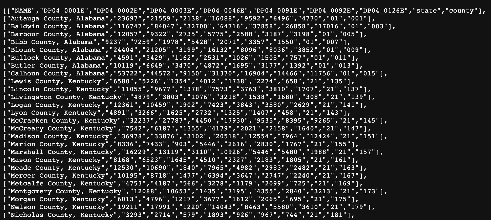
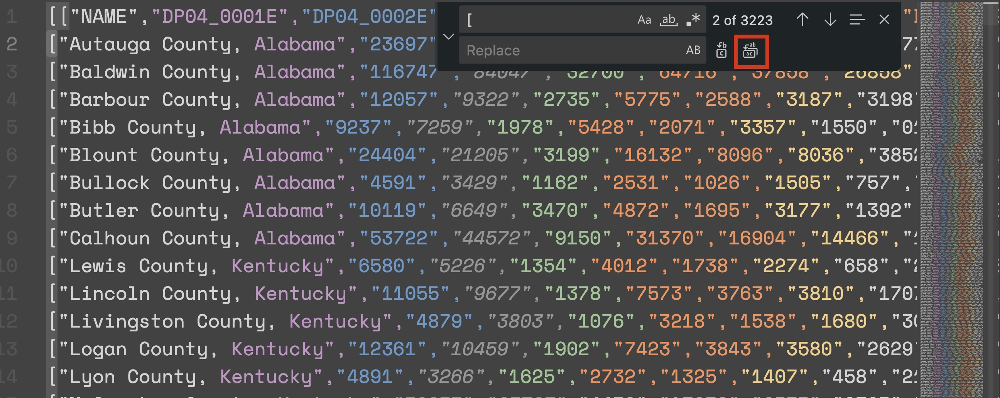
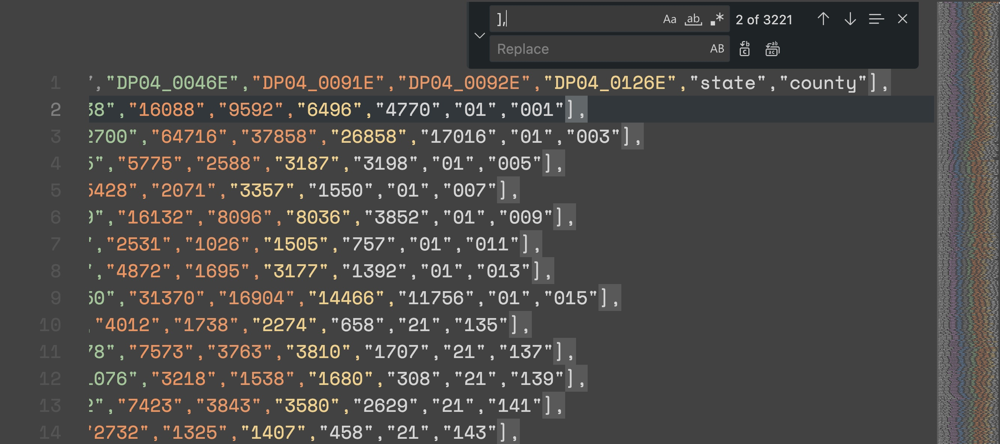
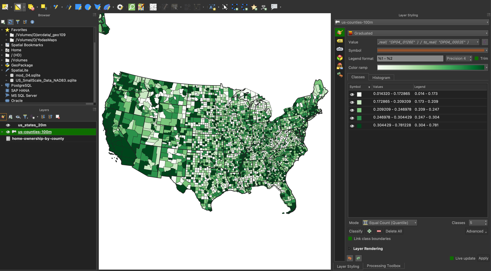

# Assignment 02: Adding user interaction to our maps

## Table of contents

<!-- TOC -->

- [Assignment 02: Adding user interaction to our maps](#assignment-02-adding-user-interaction-to-our-maps)
    - [Table of contents](#table-of-contents)
    - [Reflection from reading](#reflection-from-reading)
    - [Part I: Complete an interactive map from the lesson (5 pts)](#part-i-complete-an-interactive-map-from-the-lesson-5-pts)
        - [Deliverable](#deliverable)
    - [Part II: Interactive map of Census statistics (7.5 pts)](#part-ii-interactive-map-of-census-statistics-75-pts)
        - [The Census API](#the-census-api)
        - [Creating the map](#creating-the-map)
        - [Deliverable](#deliverable-1)
    - [Other API queries](#other-api-queries)
        - [Educational attainment](#educational-attainment)
        - [Employment and income](#employment-and-income)

<!-- /TOC -->

## Reflection from reading

From our [short reading](https://shapeofdesignbook.com/chapters/02-craft-and-beauty/) reflect upon the advice the professor gave Chimero: that his portfolio "Needs more love." Then read the task and requirements below. Consider the following questions:

1. In what ways do you believe in the map you're about to create? What gives you the inspiration to labor over your map?
2. How do you care about an intended audience for this map? Imagine if this project was for a client, e.g., a non-profit doing public advocacy around housing ownership and social issues. Now, you have two audiences.


## Part I: Complete an interactive map from the lesson (5 pts)

Run through the lesson and create the interactive map of Kentucky housing ownership patterns. While you can cut-and-paste code to (mostly) complete this part of the assignment, you should strive to understand how functions work, when they are called, and why we are passing data as arguments between functions.

### Deliverable

Complete the lesson's interactive map with the following requirement:

1. Rewrite the legend code so that the `addLegend()` function only adds the HTML legend to the map and a new function named `updateLegend()` updates the title and class range values when the user selects a new data attribute.


## Part II: Interactive map of Census statistics (7.5 pts)

So far, we've been using prepared datasets for our lessons. Let's try harvesting data directly from the Census for our analysis. In this assignment, we'll be using data from the American Community Survey (ACS) to explore home ownership rates by county in the United States. However, you are free to use any [variables](https://api.census.gov/data/2020/acs/acs5/profile/variables.html) from the ACS that you find interesting. Two example [queries](#other-api-queries) are provided. You will need at least three variables in the dropdown UI to fully complete the assignment.

### The Census API

The Census Bureau provides a web API for accessing their data. The API is documented [here](https://www.census.gov/data/developers/data-sets/acs-5year.html) and we'll use it in a later lesson to dynamically access data at runtime. For now, we'll use it download the data we need for the assignment.

The steps to download the data and prepare for mapping are:

1. Use a specially crafted URL to view county level data for the ACS 5-year estimates for 2020.
2. Copy the data from the browser into a text file.
3. Use a text editor to remove the square brackets and trailing commas.
4. Replace the variable names with the names we want to use in our analysis.
5. Save the file as a CSV.
6. Use QGIS to join the data to a county geojson similar to the first lesson.
7. Save the joined data as a geojson.

Copy the following URL, which access the same variables used in the lesson, but for all US counties. Paste it into your browser:

https://api.census.gov/data/2020/acs/acs5/profile?get=NAME,DP04_0001E,DP04_0002E,DP04_0003E,DP04_0046E,DP04_0091E,DP04_0092E,DP04_0126E&for=county:*

This URL will return JSON-formatted text:

    
*JSON returned from the Census API*

The first line of the JSON is the variable names. The second line is the data for the first county, etc. We need to copy the entire text and paste it into a blank text file in our code editor. You should have 3,222 records. Remove the square brackets and trailing commas. We can do this with a find and replace in our code editor. This example uses VS Code.

Find `[` and replace with it nothing (leave the *Replace* field blank). 


    
*Find and replace in VS Code*

Find `],` and  `]]` and, again, replace with nothing.


    
*Find and replace in VS Code*

We also need to replace the variable names with the names we want to use in our analysis. The substitutions we want to use are:

```txt
"NAME" - name of county
"TOTAL" - total number of housing units, DP04_0001E 
"OCCUPIED" - occupied housing units, DP04_0002E 
"VACANT" - vacant housing units, DP04_0003E 
"OWNER" - owner occupied housing units, DP04_0046E 
"OWNED_MORT" - owner occupied units with a mortgage or loan, DP04_0091E 
"OWNED_FREE" - occupied units owned "free and clear", DP04_0092E 
"RENTER" - number of units occupied by a renter, DP04_0126E 
"state" - State FIP id
"county" - Kentucky County FIP id
```

Ok, now we have a CSV file with the data we need. Let's save it as "acs.csv" in the `data` folder.

#### Joining the data to a county geojson

Please use the county polygon geojson from the first assignment. However, we have a [json](https://newmapsplus.github.io/assets/data/census2020/us-counties-100m.json) with county polygons simplified for 1:100M-scale mapping. Both polygon layers have a *GEOID* field that we can use to join the CSV data to the geojson. Following guidance from the first module, open QGIS, add the geojson and the CSV, and complete the join. Save the file as "acs.geojson" in the `data` folder.

If you have successfully joined the data, you could see a map like this in QGIS :

    
*Ratio occupied housing as rented*

More importantly, you now the have the ability to create mappable data from the Census API. We'll use this ability in a future lesson.

### Creating the map

You can reuse the document you created from the lesson, which will have most of the components you will need to finish this part of the assignment. However, please change the typography and choropleth color scheme. If you select different variables (examples below), you will need to decide whether (and how) an attribute needs to be normalized. Feel free to restructure the HTML and customize the CSS as you see fit. 


### Deliverable

Create an interactive map meeting the following requirements:

- the map uses a choropleth thematic type to represent quantitative data
- the map provides the user with a UI widget (either a dropdown menu or radio buttons) for updating the map and legend with a new data attribute
- allow the user to select at least three new data attributes and update the map and legend
- a tooltip or popup should display the variable name and normalized value when the user clicks a county
- the map has state and county boundaries
- the map has a clear and descriptive title/subtitle that should establish 1. **what** is being mapped, 2. **where** the phenomena is geographically, and 3. **when** the mapped phenomena occurred
- the map has a legend, including:
    - a descriptive legend title (i.e., not "legend")
    - an indication of what numeric class ranges each color represents
- the map and page are uniquely styled with novel typography and colors, i.e., if you use the lesson template, it should be altered


Save the _index.html_ file for the map within the _assignment/_ directory and commit your work as you go. When you are finish, submit a link to the repository in Canvas.

## Other API queries

The Census API is a powerful tool for accessing data. You can practice with other queries using different [variable names](https://api.census.gov/data/2020/acs/acs5/profile/variables.html). Below, are a few examples.

### Educational attainment

The American Community Survey (ACS) Table *DP02*, also known as the "Selected Social Characteristics" table, shows a variety of demographic and social characteristics of the population in the United States. For educational attainment, you could use the URL:

https://api.census.gov/data/2020/acs/acs5/profile?get=NAME,DP02_0059E,DP02_0062E,DP02_0065E,DP02_0066E&for=county:*

```txt
DP02_0059E - Population 25 years and over.
DP02_0062E - Population 25 years and over, High school graduate (includes equivalency).
DP02_0065E - Population 25 years and over, Bachelor's degree.
DP02_0066E - Population 25 years and over, Graduate or professional degree.
```
### Employment and income

*DP03* is a table that contains data on employment and income. To estimate rates of unemployment and household incomes, you could use the URL:

https://api.census.gov/data/2020/acs/acs5/profile?get=NAME,DP03_0009PE,DP03_0022PE,DP03_0062E,DP03_0063E&for=county:*

```txt
DP03_0009PE - Percent civilian labor force, Unemployed.
DP03_0022PE - Percent Workers 16 years and over that walked to work.
DP03_0062E - INCOME AND BENEFITS (IN 2021 INFLATION-ADJUSTED DOLLARS), Total households, Median household income (dollars).
DP03_0063E - INCOME AND BENEFITS (IN 2021 INFLATION-ADJUSTED DOLLARS), Total households, Mean household income (dollars).
```